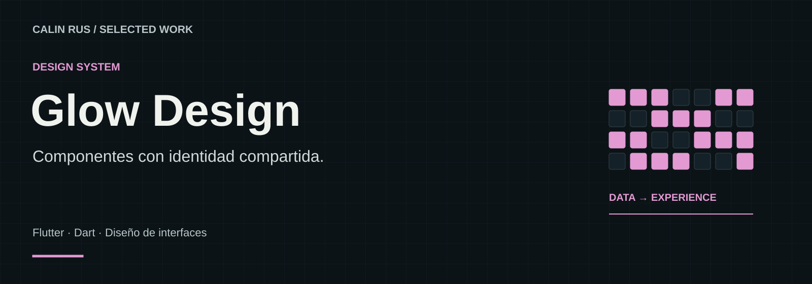
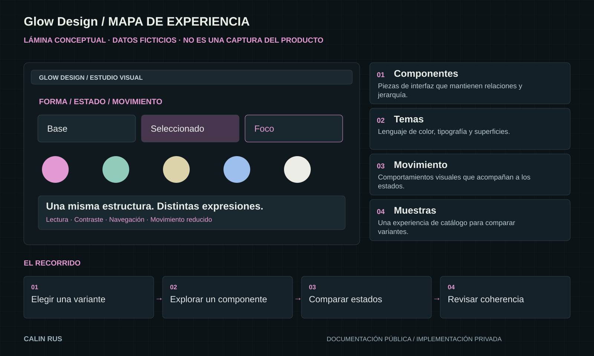

# Glow Design

**Componentes con identidad compartida.**

Una exploración de componentes, temas y movimiento ligada a la identidad Glow, cuyo recorrido continúa dentro de Nhur. Documenta cómo mantener coherencia visual entre distintas expresiones de interfaz.

**Stack:** Flutter · Dart · Diseño de interfaces  
**Estado:** Biblioteca experimental e histórica

[Portfolio](https://github.com/calinrus-dev/portfolio) · [Experiencia](docs/EXPERIENCIA.md) · [Componentes](docs/COMPONENTES.md) · [Diseño técnico](docs/ARQUITECTURA.md) · [Demostraciones](docs/DEMOSTRACIONES.md) · [Estado](docs/ESTADO.md)

## El problema que aborda

Personalizar una interfaz no debería romper su consistencia. Glow Design estudia cómo mantener una estructura reconocible mientras cambian apariencia e intensidad visual.

## Qué compone la experiencia

- **Componentes.** Piezas de interfaz que mantienen relaciones y jerarquía.
- **Temas.** Lenguaje de color, tipografía y superficies.
- **Movimiento.** Comportamientos visuales que acompañan a los estados.
- **Muestras.** Una experiencia de catálogo para comparar variantes.

*Lámina explicativa con datos ficticios. Su contenido también está disponible como texto en [Componentes](docs/COMPONENTES.md).*

## Decisiones que definen el proyecto

- **Forma y comportamiento separados.** Una variante visual no debe obligar a duplicar toda la estructura.
- **Estados antes que adornos.** Foco, selección y actividad necesitan un lenguaje consistente.
- **Movimiento con propósito.** La expresión visual debe acompañar a la lectura y la interacción.

## Explorar el caso

- [Experiencia y recorrido](docs/EXPERIENCIA.md): intención, interacción y criterios de revisión.
- [Componentes](docs/COMPONENTES.md): las piezas visibles y el papel de cada una.
- [Diseño técnico](docs/ARQUITECTURA.md): responsabilidades y compromisos de diseño.
- [Demostraciones](docs/DEMOSTRACIONES.md): qué enseñan las imágenes y cómo leer la evidencia.
- [Estado y siguientes pasos](docs/ESTADO.md): alcance actual, comprobaciones y trabajo pendiente.

## Sobre este repositorio

Caso de estudio público de un proyecto con implementación privada. Reúne documentación, diagramas e imágenes seleccionadas. Los detalles del motor, integraciones, datos operativos y código se mantienen en los repositorios privados.

Revisión editorial: 28 de septiembre de 2026. Autor: [Calin Rus](https://github.com/calinrus-dev).

[calinrus.com](https://calinrus.com) · [Instagram @c4linrus](https://www.instagram.com/c4linrus/) · [Todos los proyectos](https://github.com/calinrus-dev/portfolio)
