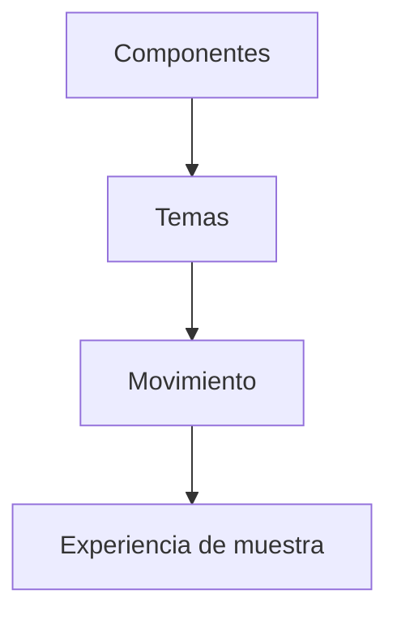

# Glow Design / Diseño técnico

[← Inicio](../README.md)

## Contexto

Una investigación de sistema visual que separa componentes, temas y movimiento para dar coherencia a diferentes expresiones de interfaz.

**Tecnologías asociadas al proyecto:** Flutter · Dart · Diseño de interfaces.

## Mapa de responsabilidades

Este mapa conceptual organiza la explicación del producto; no representa endpoints, procesos desplegados ni contratos internos.

## Forma y comportamiento separados

Una variante visual no debe obligar a duplicar toda la estructura.

## Estados antes que adornos

Foco, selección y actividad necesitan un lenguaje consistente.

## Movimiento con propósito

La expresión visual debe acompañar a la lectura y la interacción.

## Rendimiento y dependencia

Mi criterio de trabajo es medir antes de optimizar: identificar el recorrido relevante, observar tiempo de respuesta y uso de recursos y comparar cambios con la misma carga. En sistemas nativos también me interesa la disposición de datos, la localidad de memoria y el trabajo repetido.

Local-first es una preferencia arquitectónica: conservar una experiencia útil y control sobre los datos en el dispositivo, e incorporar servicios externos cuando aporten una función concreta. Su alcance varía por proyecto; no implica que todas las integraciones de este caso funcionen sin conexión.

No se publican cifras de rendimiento sin un ensayo identificado. La evidencia específica disponible está en [Estado](ESTADO.md).

## Qué conviene demostrar después

- Seleccionar componentes representativos para una futura demostración.
- Contrastar variantes con accesibilidad y reducción de movimiento.
- Conservar un catálogo de decisiones visuales.
